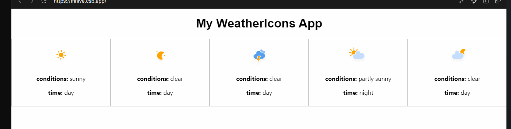

 
Title: Passing Props 

---

## Recreating WeatherForecast in React

>
#### React Hierarchy 

Here is the React Hierarchy you will be implementing:

 

**Creating The Data**
* Create a new file called `weatherData.js` that contain an array of five objects with the following properties: `img`,`conditions`,`time`.
* Populate the objects based on the values from those same elements in the HTML
* Import into `App.js`
* Console.log the file to confirm that it has been imported

**Creating The `WeatherForecast` Component**
* Look over the HTML structure used to create the weather icons
* Create a `WeatherForecast`  Component based on the HTML structure 
* Make sure to set the Component up to accept props and update the JSX to work with those props

**Rendering The `WeatherForecast` Component**
* Import the `WeatherForecast` Component into `App`
* Loop over the weatherData array data and create a `WeatherForecast` Component for each element passed
* In the loop pass the element the props it needs for `img`, `conditions` and `time`. 
* App will then render those `WeatherForecast` Components

  If successful the React Hierarchy will now look like the following:

  